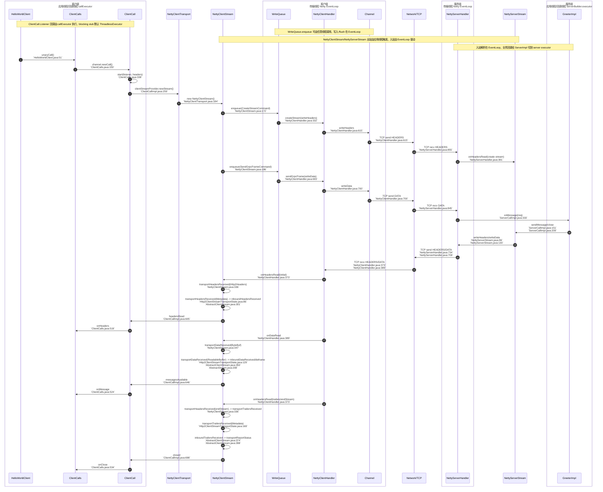
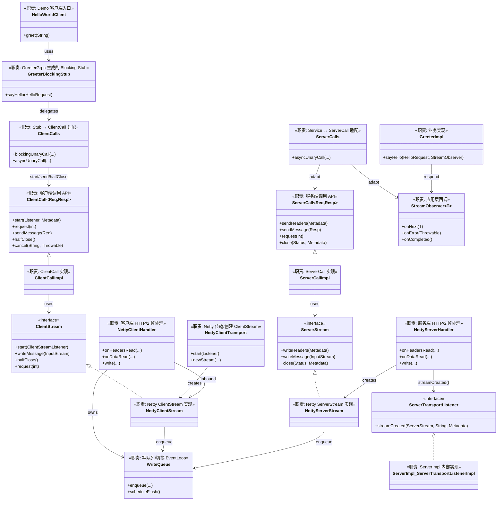

# Netty 源码阅读计划（基于 Unary HelloWorld）

下面的步骤以 `examples/src/main/java/io/grpc/examples/helloworld` 的 Unary demo 为入口，
每一步都给出关键类与源码锚点，便于对照理解 Netty 传输的端到端路径。

## 0. 从 Demo 入口开始（跑通调用链的“入口句柄”）
- 客户端入口：`examples/src/main/java/io/grpc/examples/helloworld/HelloWorldClient.java`
- 服务端入口：`examples/src/main/java/io/grpc/examples/helloworld/HelloWorldServer.java`
- 关键点：客户端 `ManagedChannelBuilder`、服务端 `ServerBuilder` 的创建与启动

## 1. Netty 传输构建入口（确认 Netty 被选为底层）
- 客户端：`netty/src/main/java/io/grpc/netty/NettyChannelBuilder.java:75`
- 服务端：`netty/src/main/java/io/grpc/netty/NettyServerBuilder.java:70`
- 关注：默认 EventLoop/ChannelFactory、TLS/明文、流控窗口等配置入口

## 2. 连接与 Transport 生命周期（从 builder 到 transport）
- 客户端传输：`netty/src/main/java/io/grpc/netty/NettyClientTransport.java:71`
- 关键方法：`start()`、`newStream()`
- 目标：理解 transport 创建、handler 绑定、stream 创建入口

## 3. Unary 请求“写出”路径（Headers/Data → Netty Channel）
1) `NettyClientStream` 产生写命令  
   - `netty/src/main/java/io/grpc/netty/NettyClientStream.java:116`
2) 写命令排队与事件循环  
   - `netty/src/main/java/io/grpc/netty/WriteQueue.java:79`
3) CreateStream 与 Data 写入  
   - `netty/src/main/java/io/grpc/netty/CreateStreamCommand.java:26`
   - `netty/src/main/java/io/grpc/netty/SendGrpcFrameCommand.java:30`
4) Netty handler 实际写出 HTTP/2 帧  
   - `netty/src/main/java/io/grpc/netty/NettyClientHandler.java:690`

## 4. Unary 请求“读入”路径（HTTP/2 帧 → gRPC 回调）
- 客户端入站：`netty/src/main/java/io/grpc/netty/NettyClientHandler.java:373`
  - `onHeadersRead` / `onDataRead` → `transportHeadersReceived/transportDataReceived`
- 服务端入站：`netty/src/main/java/io/grpc/netty/NettyServerHandler.java:391` / `netty/src/main/java/io/grpc/netty/NettyServerHandler.java:511`
  - `onHeadersRead` / `onDataRead` → 创建 `NettyServerStream` 并驱动业务

## 5. 服务端响应写出（Headers/Data）
- 服务端 stream 出站：`netty/src/main/java/io/grpc/netty/NettyServerStream.java:94`
  - `writeHeaders` / `writeFrame` / `writeTrailers`

## 6. Flow Control 与 request 语义（Unary 的 request(1)→request(2)）
- 逻辑入口：`stub/src/main/java/io/grpc/stub/ClientCalls.java:420`
- 解释：非流式响应时 `request(1)` 会转换为 `call.request(2)`，用于发现服务端误发多条响应

## 7. 协议协商（TLS/明文，影响 pipeline）
- 入口：`netty/src/main/java/io/grpc/netty/ProtocolNegotiators.java:101`
- 关注：`from(ChannelCredentials)` 返回的 negotiator 如何组装 Netty pipeline

## 推荐阅读顺序（30~60 分钟可跟完一遍）
1. HelloWorldClient/Server → 找到调用入口
2. NettyChannelBuilder/NettyServerBuilder → 确认 Netty 传输与配置入口
3. NettyClientTransport → newStream + start
4. NettyClientStream → WriteQueue → CreateStream/SendGrpcFrame
5. NettyClientHandler / NettyServerHandler → onHeadersRead/onDataRead
6. NettyServerStream → writeHeaders/writeFrame
7. ClientCalls.request(1→2) → Unary 保护逻辑

## Unary 调用链（含源码锚点，按时间顺序）
1. Demo 发起调用  
   - `examples/src/main/java/io/grpc/examples/helloworld/HelloWorldClient.java`
2. Stub -> ClientCall（channel.newCall）  
   - `stub/src/main/java/io/grpc/stub/ClientCalls.java:150`
3. ClientCall.start（注册 listener）  
   - `stub/src/main/java/io/grpc/stub/ClientCalls.java:338`
4. Transport 创建 Stream  
   - `netty/src/main/java/io/grpc/netty/NettyClientTransport.java:174`
   - `netty/src/main/java/io/grpc/netty/NettyClientStream.java:116`
5. 写请求头（CreateStreamCommand → NettyClientHandler）  
   - `netty/src/main/java/io/grpc/netty/CreateStreamCommand.java:26`
   - `netty/src/main/java/io/grpc/netty/WriteQueue.java:79`
   - `netty/src/main/java/io/grpc/netty/NettyClientHandler.java:595`
6. 写请求体（SendGrpcFrameCommand → writeData）  
   - `netty/src/main/java/io/grpc/netty/SendGrpcFrameCommand.java:30`
   - `netty/src/main/java/io/grpc/netty/NettyClientStream.java:177`
   - `netty/src/main/java/io/grpc/netty/NettyClientHandler.java:693`
7. 服务端入站：解析 HEADERS/DATA  
   - `netty/src/main/java/io/grpc/netty/NettyServerHandler.java:391`
   - `netty/src/main/java/io/grpc/netty/NettyServerHandler.java:511`
8. 服务端业务处理与响应写出  
   - `netty/src/main/java/io/grpc/netty/NettyServerStream.java:94`
9. 客户端入站：响应 HEADERS/DATA  
   - `netty/src/main/java/io/grpc/netty/NettyClientHandler.java:373`
   - `netty/src/main/java/io/grpc/netty/NettyClientHandler.java:389`
10. 回调到应用层 onMessage/onClose  
   - `stub/src/main/java/io/grpc/stub/ClientCalls.java:524`
   - `stub/src/main/java/io/grpc/stub/ClientCalls.java:534`

## Unary 调用链时序图（Mermaid）

## Unary 关键类关系图（Mermaid，含职责与 API 作用）

## 关键组件（入口 / 职责）
- Demo 入口：`examples/src/main/java/io/grpc/examples/helloworld/HelloWorldClient.java:63` / `examples/src/main/java/io/grpc/examples/helloworld/HelloWorldClient.java:46`  
  入口：`main()` / `greet()`；职责：构建 Channel、拿到 Stub、触发 Unary 调用
- Grpc 工厂：`api/src/main/java/io/grpc/Grpc.java:99` / `api/src/main/java/io/grpc/Grpc.java:132`  
  入口：`newChannelBuilder()` / `newServerBuilderForPort()`；职责：选择 Provider，返回对应 Builder
- Channel 核心实现：`core/src/main/java/io/grpc/internal/ManagedChannelImpl.java:919` / `core/src/main/java/io/grpc/internal/ManagedChannelImpl.java:950`  
  入口：`ManagedChannelImpl.newCall()` / `RealChannel.newCall()`；职责：选择调用配置并创建 `ClientCallImpl`
- 生成的 Stub：`examples/build/generated/source/proto/main/grpc/io/grpc/examples/helloworld/GreeterGrpc.java:69` / `examples/build/generated/source/proto/main/grpc/io/grpc/examples/helloworld/GreeterGrpc.java:177`  
  入口：`newBlockingStub()` / `GreeterBlockingStub.sayHello()`；职责：把业务调用转成 `ClientCalls` 调用
- ClientCalls 适配：`stub/src/main/java/io/grpc/stub/ClientCalls.java:146`  
  入口：`blockingUnaryCall()`；职责：创建 `ClientCall`、设置 `ThreadlessExecutor`、驱动 Unary 调用
- ClientCall 实现：`core/src/main/java/io/grpc/internal/ClientCallImpl.java:189` / `core/src/main/java/io/grpc/internal/ClientCallImpl.java:259`  
  入口：`start()` / `clientStreamProvider.newStream()`；职责：管理调用状态、创建 `ClientStream`、注册 Listener
- ClientStreamListenerImpl：`core/src/main/java/io/grpc/internal/ClientCallImpl.java:584`  
  入口：`ClientStreamListenerImpl` 构造；职责：把 transport 入站回调封装并投递到 `callExecutor`
- Netty 客户端传输：`netty/src/main/java/io/grpc/netty/NettyClientTransport.java:211` / `netty/src/main/java/io/grpc/netty/NettyClientTransport.java:173`  
  入口：`start()` / `newStream()`；职责：初始化 pipeline、绑定 EventLoop、创建 `NettyClientStream`
- Netty ClientStream：`netty/src/main/java/io/grpc/netty/NettyClientStream.java:336` / `netty/src/main/java/io/grpc/netty/NettyClientStream.java:347`  
  入口：`transportHeadersReceived()` / `transportDataReceived()`；职责：把 HTTP/2 入站转为 gRPC 入站处理
- WriteQueue：`netty/src/main/java/io/grpc/netty/WriteQueue.java:62` / `netty/src/main/java/io/grpc/netty/WriteQueue.java:79`  
  入口：`scheduleFlush()` / `enqueue()`；职责：写命令排队并切到 EventLoop 执行
- NettyClientHandler：`netty/src/main/java/io/grpc/netty/NettyClientHandler.java:328` / `netty/src/main/java/io/grpc/netty/NettyClientHandler.java:373` / `netty/src/main/java/io/grpc/netty/NettyClientHandler.java:389`  
  入口：`write()` / `onHeadersRead()` / `onDataRead()`；职责：HTTP/2 帧编解码与入站分发
- 协议协商：`netty/src/main/java/io/grpc/netty/ProtocolNegotiators.java:101`  
  入口：`from(ChannelCredentials)`；职责：根据凭据选择 TLS/明文并组装 pipeline
- 服务端入口：`examples/src/main/java/io/grpc/examples/helloworld/HelloWorldServer.java:35` / `examples/src/main/java/io/grpc/examples/helloworld/HelloWorldServer.java:85`  
  入口：`start()` / `GreeterImpl.sayHello()`；职责：启动 Server、实现业务逻辑
- Server 构建核心：`core/src/main/java/io/grpc/internal/ServerImplBuilder.java:241`  
  入口：`build()`；职责：构建 `ServerImpl` 与 Netty transport servers
- ServerTransportListener：`core/src/main/java/io/grpc/internal/ServerImpl.java:461`  
  入口：`streamCreated()`；职责：把 transport 入站切到 Server 执行器，初始化 ServerCall 流程
- JumpToApplicationThreadServerStreamListener：`core/src/main/java/io/grpc/internal/ServerImpl.java:505` / `core/src/main/java/io/grpc/internal/ServerImpl.java:776`  
  入口：`new JumpToApplicationThreadServerStreamListener(...)`；职责：将 stream 回调切换到应用执行器
- NettyServerHandler：`netty/src/main/java/io/grpc/netty/NettyServerHandler.java:391` / `netty/src/main/java/io/grpc/netty/NettyServerHandler.java:511`  
  入口：`onHeadersRead()` / `onDataRead()`；职责：创建 `NettyServerStream`、分发入站数据
- ServerStreamListenerImpl：`core/src/main/java/io/grpc/internal/ServerCallImpl.java:284`  
  入口：`ServerCallImpl.ServerStreamListenerImpl` 构造；职责：解析请求并回调 `ServerCall.Listener`
- ServerCallImpl：`core/src/main/java/io/grpc/internal/ServerCallImpl.java:313` / `core/src/main/java/io/grpc/internal/ServerCallImpl.java:151` / `core/src/main/java/io/grpc/internal/ServerCallImpl.java:209`  
  入口：`messagesAvailable()` / `sendMessage()` / `close()`；职责：解析请求、写响应、结束调用
- NettyServerStream：`netty/src/main/java/io/grpc/netty/NettyServerStream.java:96` / `netty/src/main/java/io/grpc/netty/NettyServerStream.java:130`  
  入口：`writeHeaders()` / `writeFrame()`；职责：服务端出站写入（经 WriteQueue）

## 线程组（入口 / 职责）
- 客户端应用线程：`examples/src/main/java/io/grpc/examples/helloworld/HelloWorldClient.java:63`  
  入口：`main()`；职责：发起调用、等待结果（blocking stub）
- 客户端回调线程 callExecutor：`api/src/main/java/io/grpc/CallOptions.java:243` / `api/src/main/java/io/grpc/ManagedChannelBuilder.java:107`  
  入口：`CallOptions.withExecutor()` / `ManagedChannelBuilder.executor()`；职责：执行 ClientCall.Listener 回调  
  说明：blocking stub 会用 `ThreadlessExecutor` 让回调在调用线程 drain（`stub/src/main/java/io/grpc/stub/ClientCalls.java:146`）
- 默认共享执行器池：`core/src/main/java/io/grpc/internal/ManagedChannelImplBuilder.java:95` / `core/src/main/java/io/grpc/internal/ServerImplBuilder.java:68`  
  入口：`DEFAULT_EXECUTOR_POOL`；职责：未显式配置 executor 时提供 `grpc-default-executor`（`core/src/main/java/io/grpc/internal/GrpcUtil.java:549`）
- 客户端 Netty EventLoopGroup：`netty/src/main/java/io/grpc/netty/NettyChannelBuilder.java:327`  
  入口：`eventLoopGroup()`；职责：客户端 I/O、WriteQueue flush、NettyClientHandler 入站处理
- 服务端 boss EventLoopGroup：`netty/src/main/java/io/grpc/netty/NettyServerBuilder.java:289`  
  入口：`bossEventLoopGroup()`；职责：接受连接
- 服务端 worker EventLoopGroup：`netty/src/main/java/io/grpc/netty/NettyServerBuilder.java:327`  
  入口：`workerEventLoopGroup()`；职责：连接 I/O、NettyServerHandler 入站处理
- 服务端应用执行器：`api/src/main/java/io/grpc/ServerBuilder.java:75` / `core/src/main/java/io/grpc/internal/ServerImpl.java:474`  
  入口：`ServerBuilder.executor()` / `ServerImpl.streamCreated()`；职责：执行业务回调（通过 SerializingExecutor）

## 组件 / 线程组之间如何交互（关键边界）
- 客户端应用线程 → EventLoop：`NettyClientStream` 出站写入通过 `WriteQueue.enqueue()` 排队，`scheduleFlush()` 使用 `channel.eventLoop().execute(...)` 切线程  
  入口：`netty/src/main/java/io/grpc/netty/WriteQueue.java:62` / `netty/src/main/java/io/grpc/netty/WriteQueue.java:79`
- 客户端 EventLoop → callExecutor：`NettyClientHandler` 入站 → `NettyClientStream.TransportState` → `ClientCallImpl.ClientStreamListenerImpl`  
  入口：`netty/src/main/java/io/grpc/netty/NettyClientHandler.java:373` / `core/src/main/java/io/grpc/internal/ClientCallImpl.java:638`
- 服务端 EventLoop → server executor：`NettyServerHandler.onHeadersRead()` 调 `transportListener.streamCreated()`，`ServerImpl` 用 SerializingExecutor/JumpListener 切到应用线程  
  入口：`netty/src/main/java/io/grpc/netty/NettyServerHandler.java:486` / `core/src/main/java/io/grpc/internal/ServerImpl.java:474`
- 服务端回调串行化链路：`JumpToApplicationThreadServerStreamListener` 在 callExecutor 上转交给 `ServerCallImpl.ServerStreamListenerImpl`  
  入口：`core/src/main/java/io/grpc/internal/ServerImpl.java:505` / `core/src/main/java/io/grpc/internal/ServerImpl.java:776` / `core/src/main/java/io/grpc/internal/ServerCallImpl.java:284`
- 服务端应用线程 → EventLoop：`ServerCallImpl.sendMessage()` → `NettyServerStream.writeFrame()` → `WriteQueue.enqueue()`  
  入口：`core/src/main/java/io/grpc/internal/ServerCallImpl.java:151` / `netty/src/main/java/io/grpc/netty/NettyServerStream.java:130`
- blocking stub 的特殊回调：`ClientCalls.blockingUnaryCall()` 创建 `ThreadlessExecutor`，回调在调用线程 `waitAndDrain()` 中执行  
  入口：`stub/src/main/java/io/grpc/stub/ClientCalls.java:146`

## 设计意图（为什么这样分层）
- 应用线程与 I/O 线程隔离：避免业务阻塞 EventLoop，靠 `callExecutor` / server executor 承接回调  
  入口：`core/src/main/java/io/grpc/internal/ClientCallImpl.java:638` / `core/src/main/java/io/grpc/internal/ServerImpl.java:474`
- 写入顺序与低延迟：`WriteQueue` 保证写命令按序执行，flush 在 EventLoop  
  入口：`netty/src/main/java/io/grpc/netty/WriteQueue.java:62`
- 传输与 API 解耦：`ClientCall`/`ServerCall` 面向 API，`ClientStream`/`ServerStream` 面向传输，便于替换传输实现  
  入口：`core/src/main/java/io/grpc/internal/ClientStream.java:30` / `core/src/main/java/io/grpc/internal/ServerStream.java:30`
- 回调顺序一致性：Server 侧通过 `SerializingExecutor` 串行化回调，避免重入  
  入口：`core/src/main/java/io/grpc/internal/ServerImpl.java:474`
- 一元保护：`request(1) → request(2)` 防止服务端误发多条响应  
  入口：`stub/src/main/java/io/grpc/stub/ClientCalls.java:420`
- 阻塞调用语义：blocking stub 用 `ThreadlessExecutor` 减少线程切换，同时保持同步等待  
  入口：`stub/src/main/java/io/grpc/stub/ClientCalls.java:146`
- 协议协商解耦：`ProtocolNegotiators` 将 TLS/明文协商抽离为独立阶段  
  入口：`netty/src/main/java/io/grpc/netty/ProtocolNegotiators.java:101`
- 默认线程池复用：共享执行器池避免每个 Channel/Server 单独起线程  
  入口：`core/src/main/java/io/grpc/internal/GrpcUtil.java:549`

## 从哪里看起（最快建立全局视角）
1. Demo 与 Grpc 工厂：`examples/src/main/java/io/grpc/examples/helloworld/HelloWorldClient.java:46` / `api/src/main/java/io/grpc/Grpc.java:99`  
2. Stub 到 ClientCalls：`examples/build/generated/source/proto/main/grpc/io/grpc/examples/helloworld/GreeterGrpc.java:177` / `stub/src/main/java/io/grpc/stub/ClientCalls.java:146`
3. ManagedChannelImpl.newCall → ClientCallImpl：`core/src/main/java/io/grpc/internal/ManagedChannelImpl.java:919` / `core/src/main/java/io/grpc/internal/ManagedChannelImpl.java:950`
4. ClientCallImpl.start/newStream：`core/src/main/java/io/grpc/internal/ClientCallImpl.java:189` / `netty/src/main/java/io/grpc/netty/NettyClientTransport.java:173`
5. NettyClientHandler 入站与 WriteQueue 出站：`netty/src/main/java/io/grpc/netty/NettyClientHandler.java:373` / `netty/src/main/java/io/grpc/netty/WriteQueue.java:79`
6. NettyServerHandler → ServerImpl → ServerCallImpl：`netty/src/main/java/io/grpc/netty/NettyServerHandler.java:391` / `core/src/main/java/io/grpc/internal/ServerImpl.java:461` / `core/src/main/java/io/grpc/internal/ServerCallImpl.java:313`

## 源码阅读计划（进阶版）
1. Grpc 工厂入口：`Grpc.newChannelBuilder/newServerBuilderForPort`  
   - `api/src/main/java/io/grpc/Grpc.java:99`  
   - `api/src/main/java/io/grpc/Grpc.java:132`
2. Channel/Server 构建：`ManagedChannelBuilder.build()` / `ServerImplBuilder.build()`  
   - `api/src/main/java/io/grpc/ManagedChannelBuilder.java:601`  
   - `core/src/main/java/io/grpc/internal/ServerImplBuilder.java:241`
3. Stub 到 ClientCalls：`GreeterGrpc.GreeterBlockingStub.sayHello()` → `ClientCalls.blockingUnaryCall()`  
   - `examples/build/generated/source/proto/main/grpc/io/grpc/examples/helloworld/GreeterGrpc.java:177`  
   - `stub/src/main/java/io/grpc/stub/ClientCalls.java:146`
4. ManagedChannelImpl.newCall → ClientCallImpl：  
   - `core/src/main/java/io/grpc/internal/ManagedChannelImpl.java:919`  
   - `core/src/main/java/io/grpc/internal/ManagedChannelImpl.java:950`
5. ClientCallImpl.start 与 newStream：  
   - `core/src/main/java/io/grpc/internal/ClientCallImpl.java:189`  
   - `netty/src/main/java/io/grpc/netty/NettyClientTransport.java:173`
6. 出站写链路：`NettyClientStream` → `WriteQueue` → `NettyClientHandler.write()`  
   - `netty/src/main/java/io/grpc/netty/NettyClientStream.java:172`  
   - `netty/src/main/java/io/grpc/netty/WriteQueue.java:79`  
   - `netty/src/main/java/io/grpc/netty/NettyClientHandler.java:328`
7. 客户端入站与回调：`NettyClientHandler.onHeadersRead` → `ClientStreamListenerImpl`  
   - `netty/src/main/java/io/grpc/netty/NettyClientHandler.java:373`  
   - `core/src/main/java/io/grpc/internal/ClientCallImpl.java:584`
8. 服务端入站与 streamCreated：`NettyServerHandler.onHeadersRead` → `ServerImpl.streamCreated`  
   - `netty/src/main/java/io/grpc/netty/NettyServerHandler.java:391`  
   - `core/src/main/java/io/grpc/internal/ServerImpl.java:461`
9. 服务端回调切换：`JumpToApplicationThreadServerStreamListener` → `ServerStreamListenerImpl`  
   - `core/src/main/java/io/grpc/internal/ServerImpl.java:505`  
   - `core/src/main/java/io/grpc/internal/ServerCallImpl.java:284`
10. 业务回调与响应写出：`ServerCallImpl.sendMessage()` → `NettyServerStream.writeFrame()`  
   - `core/src/main/java/io/grpc/internal/ServerCallImpl.java:151`  
   - `netty/src/main/java/io/grpc/netty/NettyServerStream.java:130`
11. 线程与回调切换复盘：`WriteQueue.scheduleFlush()` / `SerializingExecutor` / `ThreadlessExecutor` / `Shared Executor`  
   - `netty/src/main/java/io/grpc/netty/WriteQueue.java:62`  
   - `core/src/main/java/io/grpc/internal/ServerImpl.java:474`  
   - `stub/src/main/java/io/grpc/stub/ClientCalls.java:146`  
   - `core/src/main/java/io/grpc/internal/GrpcUtil.java:549`
12. 协议协商：`ProtocolNegotiators.from()`（TLS/明文 pipeline）  
   - `netty/src/main/java/io/grpc/netty/ProtocolNegotiators.java:101`
