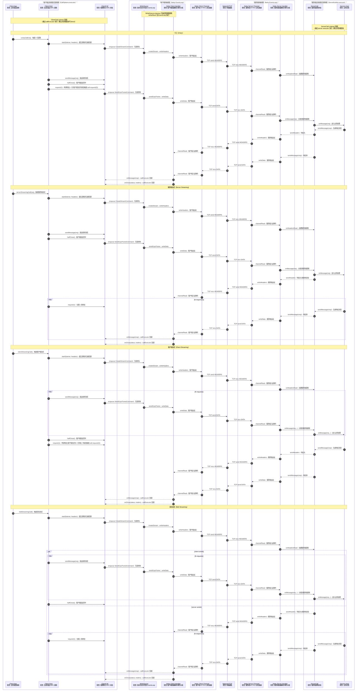
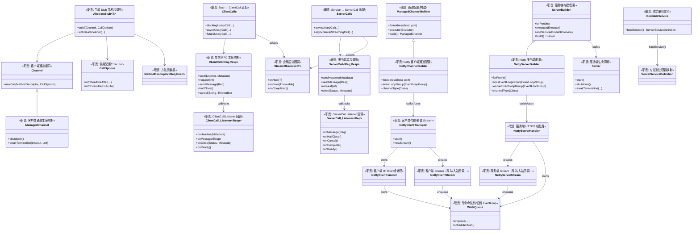

# gRPC-Java 交互方式与关键类

## 1) 四种交互方式通用流程（Mermaid，Netty 传输，含职责与 API 作用）

```mermaid
sequenceDiagram
  autonumber
  box "客户端应用线程/回调线程（CallOptions.executor）"
    participant AppC as Client App<br>职责: 业务发起调用
    participant Stub as Client Stub<br>职责: 生成/发起 RPC 调用
    participant Call as ClientCall<br>职责: 管理单次 RPC 状态
  end
  box "客户端传输线程（Netty EventLoop）"
    participant WQ as WriteQueue<br>职责: 写命令队列/切到 EventLoop
    participant NHC as Netty Client Handler<br>职责: 客户端帧编解码/事件分发
    participant NChC as Netty Client Channel<br>职责: 客户端 HTTP/2 读写通道
  end
  participant Net as Network/TCP<br>职责: 传输链路
  box "服务端传输线程（Netty EventLoop）"
    participant NChS as Netty Server Channel<br>职责: 服务端 HTTP/2 读写通道
    participant NHS as Netty Server Handler<br>职责: 服务端帧编解码/事件分发
  end
  box "服务端应用线程/回调线程（ServerBuilder.executor）"
    participant SCall as ServerCall<br>职责: 服务端调用状态
    participant Svc as Service Impl<br>职责: 业务实现
  end

  Note over WQ,NHC: WriteQueue.enqueue 可由任意线程调用<br>/write/flush 在 EventLoop 执行
  Note over AppC,Call: ClientCall.Listener 回调<br>/通过 callExecutor 执行（默认共享线程池/可 direct）
  Note over SCall,Svc: ServerCall.Listener 回调<br>/通过 server executor 执行（默认共享线程池）

  Note over AppC,Svc: 一元（Unary）
  AppC->>Stub: unaryCall(req) - 触发一元调用
  Stub->>Call: start(listener, headers) - 建立调用并注册回调
  Call->>WQ: enqueue CreateStreamCommand - 写请求头
  WQ->>NHC: createStream - writeHeaders
  NHC->>NChC: writeHeaders - 客户端出站
  NChC->>Net: TCP send HEADERS
  Net->>NChS: TCP recv HEADERS
  NChS->>NHS: channelRead - 服务端入站事件
  NHS->>SCall: onHeadersRead - 创建服务端调用
  Stub->>Call: sendMessage(req) - 发送请求消息
  Stub->>Call: halfClose() - 客户端发送完毕
  Stub->>Call: request(1) - 申请响应(一元/客户端流式内部会触发 call.request(2))
  Call->>WQ: enqueue SendGrpcFrameCommand - 写请求体
  WQ->>NHC: sendGrpcFrame - writeData
  NHC->>NChC: writeData - 客户端出站
  NChC->>Net: TCP send DATA
  Net->>NChS: TCP recv DATA
  NChS->>NHS: channelRead - 服务端入站事件
  NHS->>SCall: onMessage(req) - 分发到服务端调用
  SCall->>Svc: onMessage(req) - 进入业务处理
  Svc-->>SCall: sendMessage(resp) - 生成响应消息
  SCall-->>NHS: sendHeaders - 响应头
  NHS-->>NChS: writeHeaders - 服务端出站
  NChS-->>Net: TCP send HEADERS
  Net-->>NChC: TCP recv HEADERS
  NChC-->>NHC: channelRead - 客户端入站事件
  SCall-->>NHS: sendMessage(resp) - 响应体
  NHS-->>NChS: writeData - 服务端出站
  NChS-->>Net: TCP send DATA
  Net-->>NChC: TCP recv DATA
  NChC-->>NHC: channelRead - 客户端入站事件
  NHC-->>Call: onMessage(resp) - callExecutor 回调
  NHC-->>Call: onClose(status, trailers) - callExecutor 回调

  Note over AppC,Svc: 服务端流式（Server Streaming）
  AppC->>Stub: serverStreamingCall(req) - 触发服务端流式
  Stub->>Call: start(listener, headers) - 建立调用并注册回调
  Call->>WQ: enqueue CreateStreamCommand - 写请求头
  WQ->>NHC: createStream - writeHeaders
  NHC->>NChC: writeHeaders - 客户端出站
  NChC->>Net: TCP send HEADERS
  Net->>NChS: TCP recv HEADERS
  NChS->>NHS: channelRead - 服务端入站事件
  NHS->>SCall: onHeadersRead - 创建服务端调用
  Stub->>Call: sendMessage(req) - 发送请求消息
  Stub->>Call: halfClose() - 客户端发送完毕
  Call->>WQ: enqueue SendGrpcFrameCommand - 写请求体
  WQ->>NHC: sendGrpcFrame - writeData
  NHC->>NChC: writeData - 客户端出站
  NChC->>Net: TCP send DATA
  Net->>NChS: TCP recv DATA
  NChS->>NHS: channelRead - 服务端入站事件
  NHS->>SCall: onMessage(req) - 分发到服务端调用
  SCall->>Svc: onMessage(req) - 进入业务处理
  SCall-->>NHS: sendHeaders - 响应头(首条响应前)
  NHS-->>NChS: writeHeaders - 服务端出站
  NChS-->>Net: TCP send HEADERS
  Net-->>NChC: TCP recv HEADERS
  NChC-->>NHC: channelRead - 客户端入站事件
  loop N responses
    Stub->>Call: request(1) - 拉取 1 条响应
    Svc-->>SCall: sendMessage(resp) - 生成响应消息
    SCall-->>NHS: sendMessage(resp) - 响应体
    NHS-->>NChS: writeData - 服务端出站
    NChS-->>Net: TCP send DATA
    Net-->>NChC: TCP recv DATA
    NChC-->>NHC: channelRead - 客户端入站事件
    NHC-->>Call: onMessage(resp) - callExecutor 回调
  end
  NHC-->>Call: onClose(status, trailers) - callExecutor 回调

  Note over AppC,Svc: 客户端流式（Client Streaming）
  AppC->>Stub: clientStreamingCall() - 触发客户端流式
  Stub->>Call: start(listener, headers) - 建立调用并注册回调
  Call->>WQ: enqueue CreateStreamCommand - 写请求头
  WQ->>NHC: createStream - writeHeaders
  NHC->>NChC: writeHeaders - 客户端出站
  NChC->>Net: TCP send HEADERS
  Net->>NChS: TCP recv HEADERS
  NChS->>NHS: channelRead - 服务端入站事件
  NHS->>SCall: onHeadersRead - 创建服务端调用
  loop N requests
    Stub->>Call: sendMessage(req) - 发送请求消息
    Call->>WQ: enqueue SendGrpcFrameCommand - 写请求体
    WQ->>NHC: sendGrpcFrame - writeData
    NHC->>NChC: writeData - 客户端出站
    NChC->>Net: TCP send DATA
    Net->>NChS: TCP recv DATA
    NChS->>NHS: channelRead - 服务端入站事件
    NHS->>SCall: onMessage(req...) - 分发到服务端调用
    SCall->>Svc: onMessage(req...) - 进入业务处理
  end
  Stub->>Call: halfClose() - 客户端发送完毕
  Stub->>Call: request(1) - 申请响应(客户端流式为一元响应, 内部会触发 call.request(2))
  Svc-->>SCall: sendMessage(resp) - 生成响应消息
  SCall-->>NHS: sendHeaders - 响应头
  NHS-->>NChS: writeHeaders - 服务端出站
  NChS-->>Net: TCP send HEADERS
  Net-->>NChC: TCP recv HEADERS
  NChC-->>NHC: channelRead - 客户端入站事件
  SCall-->>NHS: sendMessage(resp) - 响应体
  NHS-->>NChS: writeData - 服务端出站
  NChS-->>Net: TCP send DATA
  Net-->>NChC: TCP recv DATA
  NChC-->>NHC: channelRead - 客户端入站事件
  NHC-->>Call: onMessage(resp) - callExecutor 回调
  NHC-->>Call: onClose(status, trailers) - callExecutor 回调

  Note over AppC,Svc: 双向流式（Bidi Streaming）
  AppC->>Stub: bidiStreamingCall() - 触发双向流式
  Stub->>Call: start(listener, headers) - 建立调用并注册回调
  Call->>WQ: enqueue CreateStreamCommand - 写请求头
  WQ->>NHC: createStream - writeHeaders
  NHC->>NChC: writeHeaders - 客户端出站
  NChC->>Net: TCP send HEADERS
  Net->>NChS: TCP recv HEADERS
  NChS->>NHS: channelRead - 服务端入站事件
  NHS->>SCall: onHeadersRead - 创建服务端调用
  par client sends
    loop N requests
      Stub->>Call: sendMessage(req) - 发送请求消息
      Call->>WQ: enqueue SendGrpcFrameCommand - 写请求体
      WQ->>NHC: sendGrpcFrame - writeData
      NHC->>NChC: writeData - 客户端出站
      NChC->>Net: TCP send DATA
      Net->>NChS: TCP recv DATA
      NChS->>NHS: channelRead - 服务端入站事件
      NHS->>SCall: onMessage(req...) - 分发到服务端调用
      SCall->>Svc: onMessage(req...) - 进入业务处理
    end
    Stub->>Call: halfClose() - 客户端发送完毕
  and server sends
    SCall-->>NHS: sendHeaders - 响应头(首条响应前)
    NHS-->>NChS: writeHeaders - 服务端出站
    NChS-->>Net: TCP send HEADERS
    Net-->>NChC: TCP recv HEADERS
    NChC-->>NHC: channelRead - 客户端入站事件
    loop N responses
      Stub->>Call: request(1) - 拉取 1 条响应
      Svc-->>SCall: sendMessage(resp) - 生成响应消息
      SCall-->>NHS: sendMessage(resp) - 响应体
      NHS-->>NChS: writeData - 服务端出站
      NChS-->>Net: TCP send DATA
      Net-->>NChC: TCP recv DATA
      NChC-->>NHC: channelRead - 客户端入站事件
      NHC-->>Call: onMessage(resp) - callExecutor 回调
    end
  end
  NHC-->>Call: onClose(status, trailers) - callExecutor 回调
```

## 2) 关键类关系图（Mermaid DSL，含职责与 API 作用）

```mermaid
classDiagram
  class ManagedChannelBuilder {
    <<职责: 通道配置/构建>>
    +forAddress(host, port)
    +executor(Executor)
    +build() ManagedChannel
  }
  class NettyChannelBuilder {
    <<职责: Netty 客户端通道配置>>
    +forAddress(host, port)
    +eventLoopGroup(EventLoopGroup)
    +channelType(Class)
  }
  ManagedChannelBuilder <|-- NettyChannelBuilder

  class Channel {
    <<职责: 客户端通道接口>>
    +newCall(MethodDescriptor, CallOptions)
  }
  class ManagedChannel {
    <<职责: 客户端通道生命周期>>
    +shutdown()
    +awaitTermination(timeout, unit)
  }
  Channel <|-- ManagedChannel

  class AbstractStub~T~ {
    <<职责: 生成 Stub 并发起调用>>
    +build(Channel, CallOptions)
    +withDeadlineAfter(...)
  }
  AbstractStub~T~ --> Channel
  AbstractStub~T~ --> CallOptions
  AbstractStub~T~ --> MethodDescriptor~Req,Resp~

  class ClientCall~Req,Resp~ {
    <<职责: 单次 RPC 生命周期>>
    +start(Listener, Metadata)
    +request(int)
    +sendMessage(Req)
    +halfClose()
    +cancel(String, Throwable)
  }
  class ClientCall_Listener~Resp~ {
    <<职责: ClientCall.Listener 回调>>
    +onHeaders(Metadata)
    +onMessage(Resp)
    +onClose(Status, Metadata)
    +onReady()
  }
  ClientCall~Req,Resp~ --> ClientCall_Listener~Resp~ : callbacks

  class ClientCalls {
    <<职责: Stub ↔ ClientCall 适配>>
    +blockingUnaryCall(...)
    +asyncUnaryCall(...)
    +futureUnaryCall(...)
  }
  ClientCalls --> ClientCall~Req,Resp~
  ClientCalls --> StreamObserver~T~ : adapts

  class StreamObserver~T~ {
    <<职责: 应用层流回调>>
    +onNext(T)
    +onError(Throwable)
    +onCompleted()
  }
  class MethodDescriptor~Req,Resp~ {
    <<职责: 方法元数据>>
  }
  class CallOptions {
    <<职责: 调用配置/Executor>>
    +withDeadlineAfter(...)
    +withExecutor(Executor)
  }

  class ServerBuilder {
    <<职责: 服务端构建/配置>>
    +forPort(int)
    +executor(Executor)
    +addService(BindableService)
    +build() Server
  }
  class NettyServerBuilder {
    <<职责: Netty 服务端配置>>
    +forPort(int)
    +bossEventLoopGroup(EventLoopGroup)
    +workerEventLoopGroup(EventLoopGroup)
    +channelType(Class)
  }
  ServerBuilder <|-- NettyServerBuilder

  class Server {
    <<职责: 服务端生命周期>>
    +start()
    +shutdown()
    +awaitTermination(...)
  }
  ServerBuilder --> Server : builds

  class BindableService {
    <<职责: 绑定服务定义>>
    +bindService() ServerServiceDefinition
  }
  class ServerServiceDefinition {
    <<职责: 方法到处理器映射>>
  }
  BindableService --> ServerServiceDefinition : bindService()

  class ServerCall~Req,Resp~ {
    <<职责: 服务端单次调用>>
    +sendHeaders(Metadata)
    +sendMessage(Resp)
    +request(int)
    +close(Status, Metadata)
  }
  class ServerCall_Listener~Req~ {
    <<职责: ServerCall.Listener 回调>>
    +onMessage(Req)
    +onHalfClose()
    +onCancel()
    +onComplete()
    +onReady()
  }
  ServerCall~Req,Resp~ --> ServerCall_Listener~Req~ : callbacks

  class ServerCalls {
    <<职责: Service ↔ ServerCall 适配>>
    +asyncUnaryCall(...)
    +asyncServerStreamingCall(...)
  }
  ServerCalls --> ServerCall~Req,Resp~
  ServerCalls --> StreamObserver~T~ : adapts

  class NettyClientTransport {
    <<职责: 客户端传输/创建 Stream>>
    +start()
    +newStream()
  }
  class NettyClientHandler {
    <<职责: 客户端 HTTP/2 帧处理>>
  }
  class NettyClientStream {
    <<职责: 客户端 Stream（写入/入站回调）>>
  }
  class NettyServerHandler {
    <<职责: 服务端 HTTP/2 帧处理>>
  }
  class NettyServerStream {
    <<职责: 服务端 Stream（写入/入站回调）>>
  }
  class WriteQueue {
    <<职责: 写命令队列/切到 EventLoop>>
    +enqueue(...)
    +scheduleFlush()
  }

  NettyChannelBuilder --> NettyClientTransport : builds/uses
  NettyClientTransport --> NettyClientHandler : owns
  NettyClientTransport --> NettyClientStream : creates
  NettyClientHandler --> WriteQueue : owns
  NettyClientStream --> WriteQueue : enqueue

  NettyServerBuilder --> NettyServerHandler : builds/uses
  NettyServerHandler --> NettyServerStream : creates
  NettyServerHandler --> WriteQueue : owns
  NettyServerStream --> WriteQueue : enqueue
```
